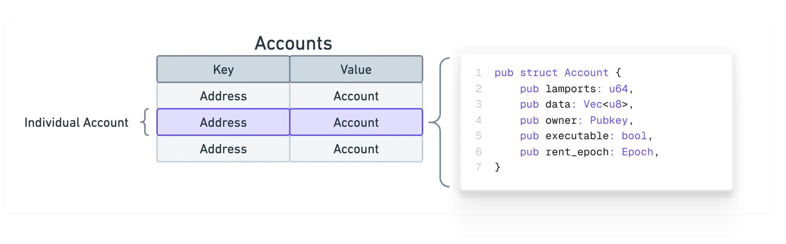
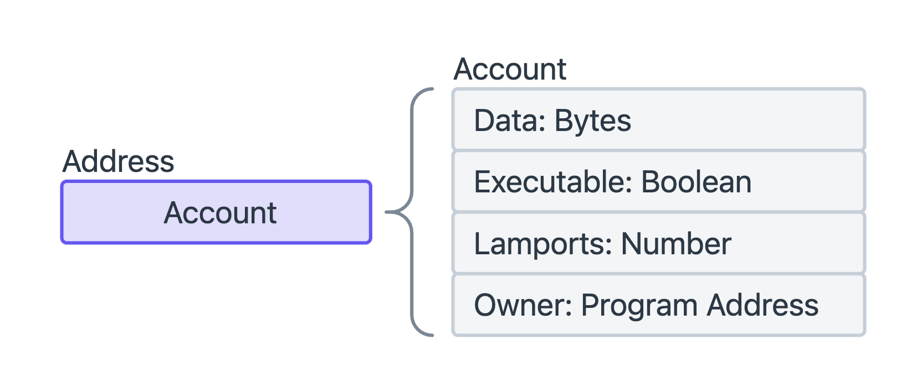
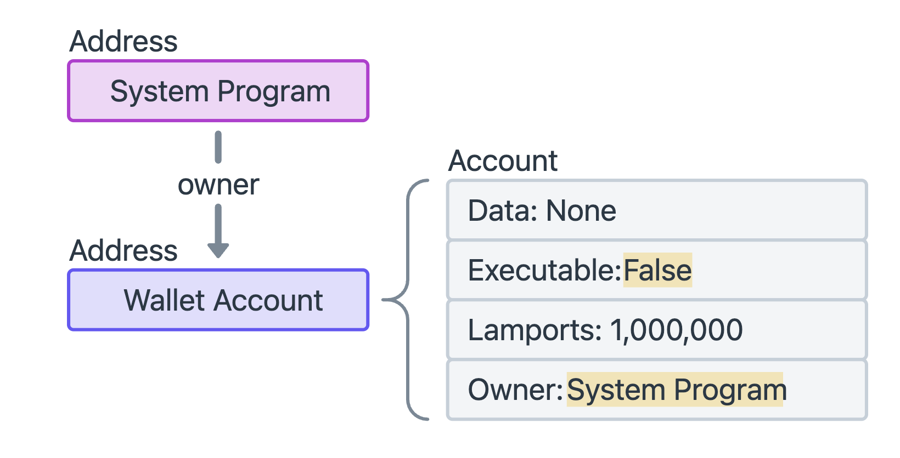

# WTF Solana Web3.js 极简教程：4. 账户

WTF Solana Web3.js 极简教程属于 WTF Solana 教程的一部分，由 WTF Academy 和 ChainBuff 共同推出。

**推特**：[@0xAA_Science](https://twitter.com/0xAA_Science) ｜ [@WTFAcademy_](https://twitter.com/WTFAcademy_) ｜ [@ChainBuff](https://twitter.com/ChainBuff)

**WTF Academy 社群：** [官网 wtf.academy](https://wtf.academy) | [微信群申请](https://docs.google.com/forms/d/e/1FAIpQLSe4KGT8Sh6sJ7hedQRuIYirOoZK_85miz3dw7vA1-YjodgJ-A/viewform?usp=sf_link) ｜ [Discord](https://discord.gg/5akcruXrsk)

所有代码和教程开源在 GitHub: [github.com/WTFAcademy/WTF-Solana](https://github.com/WTFAcademy/WTF-Solana)

---

## 1. Solana 中的账户

在 Solana 中，一切（钱包、状态、程序）都是账户。您可以将 Solana 上的数据视为一个公共数据库，其中包含一个“帐户”表，该表中的每个条目都是一个“帐户”。



Solana 上的每个帐户都有一个唯一的 32 字节地址，通常显示为 base58 编码的字符串（例如`6fuivRGE5Fr9bwkW2Wu1E2wTMQ8RnoNgtZb8tievLVmb`）。

账户与其地址之间的关系类似于键值对，其中地址是定位账户对应链上数据的关键。账户地址充当“账户”表中每个条目的“唯一ID”。




每个账户都拥有以下字段：

1. `lamports`: 当前账户余额，以lamports为单位（1 SOL = 10⁹ lamports）。
2. `owner`: 帐户所有者的程序ID（Programs ID）。在 Solana 中，智能合约被称为程序（Program），而程序ID就是程序账户的公钥。只有所有者程序可以更改帐户的数据或扣除其 Lamport 余额。
3. `data` 账户的数据区，可以存储账户相关的字节数组。对于不可执行的账户，这通常存储需要读取的状态。对于程序账户，这包含可执行的程序代码。数据字段通常称为“账户数据”。这里与以太坊的账户结构不同，Solana 账户内部没有 `storage`，如果需要存储状态，则需要创建新的账户进行存储。
4. `executable` 是否为可执行程序。
5. `rentEpoch` 租金相关字段，已废弃。

## 2. 读取账户信息

我们可以利用 `connection.getAccountInfo` 方法来读取账户信息。

```ts
// 连接主网
const connection = new Connection(clusterApiUrl("mainnet-beta"), "confirmed");

// 获取账户信息
const pubkey = new PublicKey("6fuivRGE5Fr9bwkW2Wu1E2wTMQ8RnoNgtZb8tievLVmb")
const accountInfo = await connection.getAccountInfo(pubkey);
console.log(JSON.stringify(accountInfo, null, 2));
```

### 输出样例

由于这是一个钱包账户，因此 `executable = false`，`data` 为空，`owner` 为系统程序，钱包中的余额为 `96302360` lamports，也就是 `0.096302360` SOL。

```
{
  "data": {
    "type": "Buffer",
    "data": []
  },
  "executable": false,
  "lamports": 96302360,
  "owner": "11111111111111111111111111111111",
  "rentEpoch": 18446744073709552000,
  "space": 0
}
```

## 3. 几种常用账户类型

### 系统程序账户

系统程序（System Program）是 Solana 的内核级程序，地址为 `11111111111111111111111111111111`，主要负责账户的创建、空间分配、转移/分配程序所有权。默认情况下，所有新帐户都归系统程序所有。

系统程序是所有钱包账户的所有者，并且只有系统程序拥有的账户才能支付交易费。




### 程序账户

部署 Solana 智能合约（程序）会创建一个程序账户（Program Account），该账户存储了程序的可执行代码，其中：

- `executable = true`

- `owner` = `BPFLoader` 或 `BPFLoaderUpgradeable`

- `data` 存储的是 BPF 字节码（Rust 编译产物，类似以太坊的EVM字节码）


另外还有用于存储系统数据（如 `clock` `fees`）的 `Sysvar` 账户，数据帐户等账户类型，我们会在之后的教程中逐个介绍。


## 4. 创建账户

下面，我们用 `SystemProgram.createAccount` 方法创建一个新的账户，将该账户的所有者设置为系统账户，并给它分配64字节的数据空间。

```ts
// 读取已有私钥作为付款账户
const secretKeyBase58 = fs.readFileSync("wallet.txt", "utf-8");
const payer = Keypair.fromSecretKey(bs58.decode(secretKeyBase58));

// 创建新账户
const newAccount = Keypair.generate();

// 你可以先用 SystemProgram 作为 owner（表示这个账户没有合约逻辑）
const programId = SystemProgram.programId;

// 分配 64 字节空间（可自定义）
const space = 64;

const main = async () => {
  // 获取租金豁免所需 lamports
  const lamports = await connection.getMinimumBalanceForRentExemption(space);
  console.log("需要的租金:", lamports / LAMPORTS_PER_SOL, "SOL");

  // 创建指令
  const instruction = SystemProgram.createAccount({
    fromPubkey: payer.publicKey,
    newAccountPubkey: newAccount.publicKey,
    lamports,
    space,
    programId,
  });

  const tx = new Transaction().add(instruction);

  // 发送交易
  console.log("🚀 正在创建账户...");
  const sig = await sendAndConfirmTransaction(connection, tx, [payer, newAccount]);

  console.log("✅ 账户创建成功！");
  const accountAddress = newAccount.publicKey
  console.log("新账户地址:", accountAddress.toBase58());
  console.log("交易哈希:", sig);
  console.log(`🔍 https://solscan.io/tx/${sig}?cluster=mainnet-beta`);

  const accountInfo2 = await connection.getAccountInfo(accountAddress);

  if (!accountInfo2) {
    console.log("❌ 账户不存在或尚未初始化");
    return;
  }else{
    console.log("✅ 账户创建成功");
    console.log(JSON.stringify(accountInfo2, null, 2));
  }
};
```

### 输出样例

```
需要的租金: 0.00133632 SOL
🚀 正在创建账户...
✅ 账户创建成功！
新账户地址: FoTafrESXHe82hCNELczhtBAN1eGu1CTrN9yxbbWx5Ez
交易哈希: 2LddWMVmWeKcbCapeWTBAqCty8HFC5dYh5ygaK2vf2UUTurbXPeCrh9y8uiftgAdavJSv4xH2FwPto1ma5ky23yE
🔍 https://solscan.io/tx/2LddWMVmWeKcbCapeWTBAqCty8HFC5dYh5ygaK2vf2UUTurbXPeCrh9y8uiftgAdavJSv4xH2FwPto1ma5ky23yE?cluster=mainnet-beta
{
  "data": {
    "type": "Buffer",
    "data": [
      0,
      0,
      ...
      0
    ]
  },
  "executable": false,
  "lamports": 1336320,
  "owner": "11111111111111111111111111111111",
  "rentEpoch": 18446744073709552000,
  "space": 64
}
```

## 5. 总结

这一讲，我们学习了：
- Solana上的账户概念，以及常用账户类型
- 读取账户信息
- 创建账户

