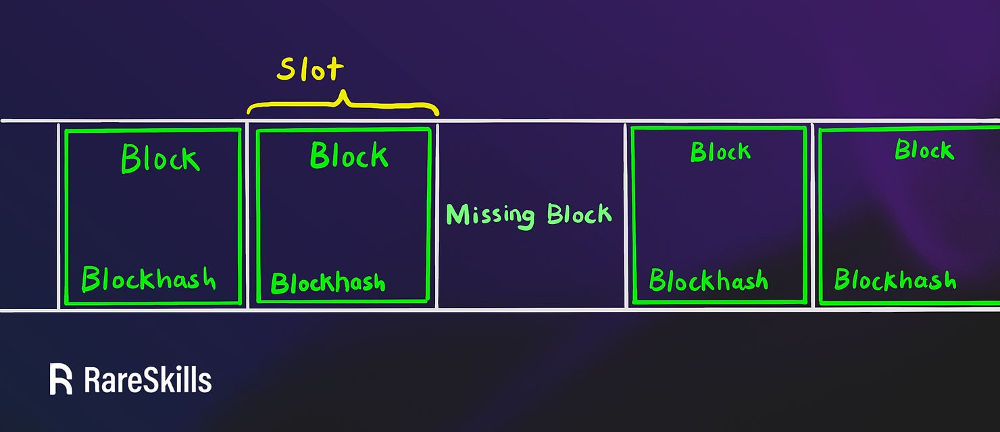
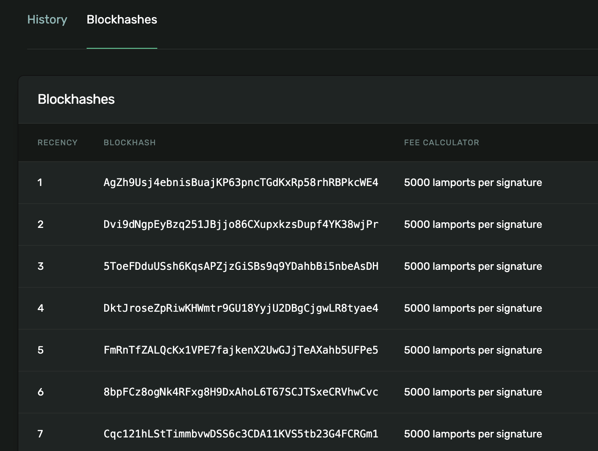

---

title: 5. Slot 与 Block
tags:
 - solana
 - blockchain
 - web3js
 - slot
 - block
 - blockhash

---

# WTF Solana Web3.js 极简教程：第 5 讲：Slot 与 Block

这一讲，我们将介绍 Solana 链上的时间机制核心：`slot`（插槽）与 `block`（区块），以及如何通过 Web3.js 读取相关信息。

## 1. 什么是 Slot 与 Block？

在 Solana 中：

- `Slot` 是 Solana 的时间单元，每个验证者大约每 **400 ms** 尝试生成一个区块，因此每个 slot 也以此为间隔周期；
- `Block` 是实际产出的区块数据。**每个 slot 最多产生一个 block**，但并非所有 slot 都会产出 block。实际运行中，约有 **6% 的 slot 是空的**（即未产出 block）。



Solana 中的 Slot 编号（`slot number`）、Block 编号（`block number`）、和 Block 高度（`block height`）容易混淆。我们以上图为例，解释他们的区别：

| Slot Number  | 1 | 2 | 3 | 4 | 5 |
| ------------ | - | - | - | - | - |
| Block Number | 1 | 2 |   | 4 | 5 |
| Block Height | 1 | 2 |   | 3 | 4 |


- **Slot Number**：每 400ms 自增，无论是否产块；
- **Block Number**：与 Slot 一一对应，但空块位置为空；
- **Block Height**：只计算成功产出的区块，高度连续递增。


以太坊和Solana的区块机制有很大不同：

以太坊每12秒一个块，并且区块总是被产出。而Solana每400ms一个Slot，每个 Slot 有 0 或 1 个区块 。


## 2. Blockhash

每一个 block 会生成唯一的 `blockhash`，作为这个区块的哈希摘要，可以作为该区块的标识符。我们可以在[Solana区块浏览器](https://explorer.solana.com/address/SysvarRecentB1ockHashes11111111111111111111/blockhashes)中查看最近的 `blockhash`：



Solana 上的每笔交易都**必须引用一个最近的 blockhash**。这里，最近的blockhash（recentBlockHash）指150个slot以内的某个区块的哈希，也就当前区块60秒（400ms * 150）以内的区块哈希都可以用。这有助于防止交易重放攻击。

以太坊的账户体系使用nonce来防止交易重放，如果一个多个交易使用了同一个nonce，只有第一笔能上链，之后的会失败。Solana 为了实现高并发和低延迟，没有采用nonce机制，而是采用了基于 `blockhash` 的交易唯一性机制：

1. 每个交易都要包涵一个 `blockhash`:

```ts
const tx = new Transaction({
  blockhash, // 这是 recent blockhash
  feePayer,
}).add(instruction);
```

2. 如果交易使用的 `blockhash` 超过150个区块，过期了，那么交易会失败。

3. 如果两个交易内容相同，并且用了同样的 `blockhash`，那么其中只有一笔交易会上链，这样就可以防止重放攻击。


## 3. 读取 Slot/Block/Blockhash

我们可以使用 Web3.js 的 `Connection` 类的方法进行查询：

1. `connection.getSlot()` 可以读取Slot。

```ts
import {
  Connection,
  clusterApiUrl,
} from "@solana/web3.js";

const connection = new Connection(clusterApiUrl("mainnet-beta"), "confirmed");

// 当前 Slot
const slot = await connection.getSlot();
console.log("当前 Slot:", slot);
```

输出

```
当前 slot: 346566496
```


2. `connection.getLatestBlockhash()` 可以读取最新blockhash和失效区块高度，发送交易时会用到。

```ts
const latestBlockhash = await connection.getLatestBlockhash();
console.log("最新区块hash:", latestBlockhash.blockhash);
console.log("失效区块高度（当前高度+150）:", latestBlockhash.lastValidBlockHeight);
```

输出

```
最新区块hash: 3FScCsuCYL9AcCdLgqyZCzF9vq9wqwJGhPGLKKDWkbeZ
失效区块高度（当前高度+150）: 324774965
```

3. `connection.getBlock(slot)` 可以读取指定Slot的区块数据，包括Block高度/时间/哈希，父Slot数，前一个Blockhash，以及区块中包含的交易数据

```ts
// 3. 获取该 Slot 的 Block
const config: GetVersionedBlockConfig = {
  maxSupportedTransactionVersion: 0,
  rewards: false,
  transactionDetails: "full"
};
const block = await connection.getBlock(slot, config);
console.log("Block内容:", block);
```

输出

```
Block内容: {
  blockHeight: 324774814,
  blockTime: 1749835298,
  blockhash: '5FeaCmCrT9LbRpmbcRS9nXrufNY49vFvrBNFkiqkripq',
  parentSlot: 346566495,
  previousBlockhash: 'ArMFKV4ZZsWz7i2yFBiP5VNvuzr8WNErQhN51tqXgvAf',
  transactions: [
    { meta: [Object], transaction: [Object], version: 'legacy' },
    { meta: [Object], transaction: [Object], version: 'legacy' },
    { meta: [Object], transaction: [Object], version: 'legacy' },
    ...
  ]
}
```

4. `connection.getBlockTime(slot)` 可以让我们读取该slot的区块时间。

```ts
// 4. 获取该 slot 的 block 时间（Unix 时间戳）
const timestamp = await connection.getBlockTime(slot);
if (timestamp !== null) {
  console.log("区块时间:", new Date(timestamp * 1000).toLocaleString());
} else {
  console.log("无法获取时间戳（可能是跳过 slot）");
}
```

输出

```
区块时间: 2025/6/14 01:21:38
```

## 4. 使用 blockhash 构建交易

之前我们写转账交易的时候，并没有传入 `blockhash`，这是因为 Solana Web3js 的 `sendAndConfirmTransaction` 帮我们封装了获取并传入 `blockhash` 的过程。

我们可以在创建 `Transaction` 对象的时候传入 `blockhash` 和 `lastValidBlockHeight`，然后将交易签名后发出。

```ts
// 获取 blockhash
const { blockhash, lastValidBlockHeight } = await connection.getLatestBlockhash();

// 创建交易并传入 blockhash
const transaction = new Transaction({
  feePayer: sender.publicKey,
  blockhash,
  lastValidBlockHeight,
}).add(instruction);

// 发送交易
transaction.sign(sender); // 签名交易
const signature = await connection.sendRawTransaction(transaction.serialize()); // 发送交易
```

## 5. 总结

这一讲，我们介绍了 Solana 的 Slot 和 Block 概念，并使用 Web3js 读取了 Slot/Block/Blockhash。Solana 上的每笔交易都必须引用一个最近的 blockhash，但 Web3js 已经在 `sendTransaction` 和 `sendAndConfirmTransaction` 等函数中封装了这个过程，不需要我们显示的获取与传入。
