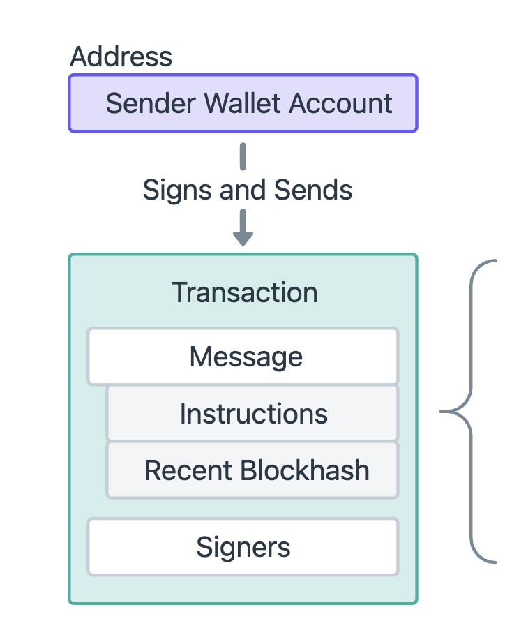
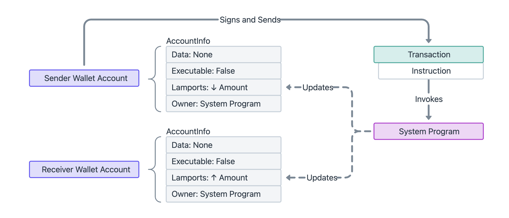

---

title: 6. 读取交易
tags:
 - solana
 - blockchain
 - web3js
 - transaction
 - account
 - signature

---

# WTF Solana Web3.js 极简教程：第 6 讲：读取交易

WTF Solana Web3.js 极简教程属于 WTF Solana 教程的一部分，由 WTF Academy 和 ChainBuff 共同推出。

**推特**：[@0xAA_Science](https://twitter.com/0xAA_Science) ｜ [@WTFAcademy_](https://twitter.com/WTFAcademy_) ｜ [@ChainBuff](https://twitter.com/ChainBuff)

**WTF Academy 社群：** [官网 wtf.academy](https://wtf.academy) | [微信群申请](https://docs.google.com/forms/d/e/1FAIpQLSe4KGT8Sh6sJ7hedQRuIYirOoZK_85miz3dw7vA1-YjodgJ-A/viewform?usp=sf_link) ｜ [Discord](https://discord.gg/5akcruXrsk)

所有代码和教程开源在 GitHub: [github.com/WTFAcademy/WTF-Solana](https://github.com/WTFAcademy/WTF-Solana)

---

这一讲，我们将深入了解 Solana 区块链上的交易结构，学习如何读取并解析交易。

## 1. 读取交易

Solana 的每一笔交易都由签名（tx signature）标识，可以使用 Web3.js 的 `getTransaction()` 方法获取交易详情：

```ts
import { Connection, clusterApiUrl, VersionedBlockResponse } from "@solana/web3.js";

const connection = new Connection(clusterApiUrl("mainnet-beta"), "confirmed");

// 替换为你想查询的交易哈希
const txSig = "3vr9oZwTcdbLGJfMEX5auy82FFScMBfb5fzfj5SELMqzGuCCNqPV44QsE8rQVTTTmbqTenM1Eogh7aaeN1jnup8g";

(async () => {
  // 读取单笔交易
  const tx = await connection.getTransaction(txSig, {
    maxSupportedTransactionVersion: 0,
  });
  console.log(JSON.stringify(tx, null, 2));
})()
```

交易详情输出如下（这是我们在第3讲构造的交易）：

```json
{
  "blockTime": 1747920090,
  "meta": {
    "computeUnitsConsumed": 150,
    "err": null,
    "fee": 5000,
    "innerInstructions": [],
    "loadedAddresses": {
      "readonly": [],
      "writable": []
    },
    "logMessages": [
      "Program 11111111111111111111111111111111 invoke [1]",
      "Program 11111111111111111111111111111111 success"
    ],
    "postBalances": [
      98995000,
      35861201889,
      1
    ],
    "postTokenBalances": [],
    "preBalances": [
      100000000,
      35860201889,
      1
    ],
    "preTokenBalances": [],
    "rewards": [],
    "status": {
      "Ok": null
    }
  },
  "slot": 341716180,
  "transaction": {
    "message": {
      "header": {
        "numReadonlySignedAccounts": 0,
        "numReadonlyUnsignedAccounts": 1,
        "numRequiredSignatures": 1
      },
      "accountKeys": [
        "6fuivRGE5Fr9bwkW2Wu1E2wTMQ8RnoNgtZb8tievLVmb",
        "4xxeGf2jZAyLVW1sEELTJy2Fd4hwRerNTDCg8ZQuH4tn",
        "11111111111111111111111111111111"
      ],
      "recentBlockhash": "CsQtmcDXqjZtCCm3qGa6dH5XbEdMHwwsUn2ixWGYQ6a",
      "instructions": [
        {
          "accounts": [
            0,
            1
          ],
          "data": "3Bxs4Bc3VYuGVB19",
          "programIdIndex": 2,
          "stackHeight": null
        }
      ],
      "indexToProgramIds": {}
    },
    "signatures": [
      "3vr9oZwTcdbLGJfMEX5auy82FFScMBfb5fzfj5SELMqzGuCCNqPV44QsE8rQVTTTmbqTenM1Eogh7aaeN1jnup8g"
    ]
  },
  "version": "legacy"
}
```

看起来有点复杂，但其实只包含5个部分：

1. 区块时间 `"blockTime": 1747920090`
2. 插槽编号 `"slot": 341716180,`
3. 版本 `"version": "legacy"`，我们会在之后的教程中介绍交易版本。
4. 元数据 `meta` 包含交易状态、SOL 余额变化、计算单元消耗等元数据。
5. 详情 `transaction` 包括签名、公钥、区块哈希、指令等。

我们接下来详细学习一下 `meta` 和 `transaction`

## 2. 交易详情

首先，我们来看一下交易详情 `transaction` 的内容：

```ts
  "transaction": {
    "message": {
      "header": {
        "numReadonlySignedAccounts": 0,
        "numReadonlyUnsignedAccounts": 1,
        "numRequiredSignatures": 1
      },
      "accountKeys": [
        "6fuivRGE5Fr9bwkW2Wu1E2wTMQ8RnoNgtZb8tievLVmb",
        "4xxeGf2jZAyLVW1sEELTJy2Fd4hwRerNTDCg8ZQuH4tn",
        "11111111111111111111111111111111"
      ],
      "recentBlockhash": "CsQtmcDXqjZtCCm3qGa6dH5XbEdMHwwsUn2ixWGYQ6a",
      "instructions": [
        {
          "accounts": [
            0,
            1
          ],
          "data": "3Bxs4Bc3VYuGVB19",
          "programIdIndex": 2,
          "stackHeight": null
        }
      ],
      "indexToProgramIds": {}
    },
    "signatures": [
      "3vr9oZwTcdbLGJfMEX5auy82FFScMBfb5fzfj5SELMqzGuCCNqPV44QsE8rQVTTTmbqTenM1Eogh7aaeN1jnup8g"
    ]
  },
```


它包含消息 `message` 和签名 `signatures` 两个部分：




交易消息 `message` 又包含以下几个字段：

1. 消息头 `header` 指定签名者和只读账户的数量。

```json
"header": {
  "numReadonlySignedAccounts": 0,
  "numReadonlyUnsignedAccounts": 1,
  "numRequiredSignatures": 1
},
```

2. 账户公钥 `accountKeys` 指定交易指令所需的账户地址数组。这个交易指定了三个账户，分别是发送者，接收者，和SOL代币账户：

```json
"accountKeys": [
  "6fuivRGE5Fr9bwkW2Wu1E2wTMQ8RnoNgtZb8tievLVmb",
  "4xxeGf2jZAyLVW1sEELTJy2Fd4hwRerNTDCg8ZQuH4tn",
  "11111111111111111111111111111111"
],
```

3. 最近的区块哈希 `recentBlockhash`：作为交易的时间戳。

```json
"recentBlockhash": "CsQtmcDXqjZtCCm3qGa6dH5XbEdMHwwsUn2ixWGYQ6a",
```

4. 指令 `instructions`：要执行的指令数组。

```json
"instructions": [
  {
    "accounts": [
      0,
      1
    ],
    "data": "3Bxs4Bc3VYuGVB19",
    "programIdIndex": 2,
    "stackHeight": null
  }
],
```

我们可以使用 `connection.getParsedTransaction(sig)` 来解析指令。

```ts
// 读取单笔交易详情（交易指令解析）
const parsedTx = await connection.getParsedTransaction(txSig, {
  maxSupportedTransactionVersion: 0,
});
console.log(JSON.stringify(parsedTx?.transaction?.message?.instructions, null, 2));
```

解析后的指令：

```json
{
  "parsed": {
    "info": {
      "destination": "4xxeGf2jZAyLVW1sEELTJy2Fd4hwRerNTDCg8ZQuH4tn",
      "lamports": 1000000,
      "source": "6fuivRGE5Fr9bwkW2Wu1E2wTMQ8RnoNgtZb8tievLVmb"
    },
    "type": "transfer"
  },
  "program": "system",
  "programId": "11111111111111111111111111111111",
  "stackHeight": null
}
```

这个指令的类型是转账 `transfer`，发起账户 `6fui...` 向账户 `4xxe...` 转账 1000000 lamports，也就是 0.001 SOL。转账指令由系统程序执行，程序账户（SOL代币账户）为 `11111111111111111111111111111111`。

最后是签名 `signatures`，包含交易指令中要求作为签名者的所有账户的签名数组。签名是通过使用账户对应的私钥对交易消息进行签名而创建的。如果交易包含多个签名，那么交易哈希就是第一个签名者的签名。

## 3. 元数据 meta

接下来，让我们来看一下交易的元数据 `meta` 部分

```json
  "meta": {
    "computeUnitsConsumed": 150,
    "err": null,
    "fee": 5000,
    "innerInstructions": [],
    "loadedAddresses": {
      "readonly": [],
      "writable": []
    },
    "logMessages": [
      "Program 11111111111111111111111111111111 invoke [1]",
      "Program 11111111111111111111111111111111 success"
    ],
    "postBalances": [
      98995000,
      35861201889,
      1
    ],
    "postTokenBalances": [],
    "preBalances": [
      100000000,
      35860201889,
      1
    ],
    "preTokenBalances": [],
    "rewards": [],
    "status": {
      "Ok": null
    }
  },
```

它包含：

1.  `"computeUnitsConsumed": 150` 交易消耗的交易单元（CU），类似以太坊中交易消耗的gas。我们会在后面的教程中介绍它。
2. `"err": null` 是否报错，这个交易没有报错，成功执行并上链。
3. `"fee": 5000` 交易费用 5000 lamports 。
4. `"innerInstructions": []`，合约内部调用，这个交易没有用到。
5. `"loadedAddresses"`，加载的地址（Address Lookup Table，也称 ALT），这个交易没有用到。
6. `"logMessages"`，交易日志，类似于以太坊交易中的事件，用来记录一些数据。这里表示程序成功调用合约 `11111111111111111111111111111111`，也就是 `SOL` 原生代币。

```json
"logMessages": [
  "Program 11111111111111111111111111111111 invoke [1]",
  "Program 11111111111111111111111111111111 success"
],
```

7. `preBalances` 和 `postBalances`，记录账户交易前后的 `SOL` 余额，数组的顺序跟交易详情中的 `accountKeys` 字段一样。账户 0/1/2 分别为 `6fui...`/`4xxe...`/SOL代币账户。可以看到，SOL 余额的变化反映了交易转账 0.0001 SOL 的结果。

```json
"preBalances": [
  100000000,
  35860201889,
  1
],
"postBalances": [
  98995000,
  35861201889,
  1
],
```

| 账户     | 地址缩写          | 扣费前余额       | 扣费后余额        | 变化说明                                |
| ------ | ------------- | ----------- | ------------ | ----------------------------------- |
| 账户0 | 发送者           | 0.1 SOL     | 0.098995 SOL | 转出 0.001 SOL + 支付 5000 lamports 手续费 |
| 账户1 | 接收者           | 35.8602 SOL | 35.8612 SOL  | 收到 0.001 SOL                        |
| 账户2 | SystemProgram | 1           | 1            | 程序账户，无变化                            |



8. `preTokenBalances` 和 `postTokenBalances`，记录账户交易前后的代币余额。这个交易不涉及代币，因此为空。
9. `rewards`，出块奖励。
10. `status` 交易状态，`Ok`代表交易成功，`Err`代表交易失败并返回错误信息。

```json
"status": {
  "Ok": null
}
```

## 4. 总结

这一讲，我们介绍了 Solana 交易的结构内容，以及如何使用 `getTransaction` 读取指定交易，如何使用 `getParsedTransaction` 解析交易指令。
