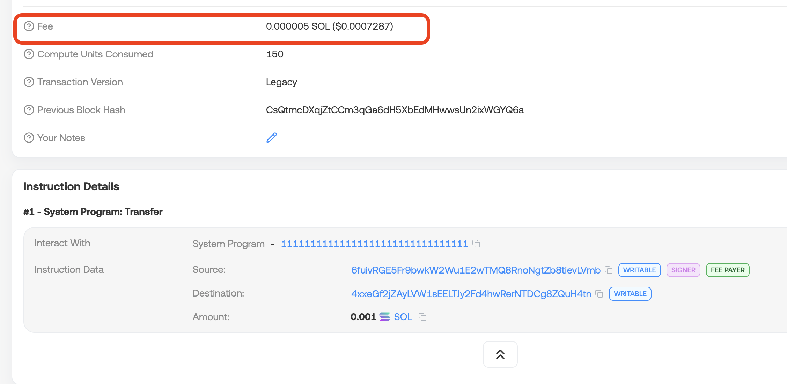

# WTF Solana Web3.js 极简教程：第 10 讲：优先费

WTF Solana Web3.js 极简教程属于 WTF Solana 教程的一部分，由 WTF Academy 和 ChainBuff 共同推出。

**推特**：[@0xAA_Science](https://twitter.com/0xAA_Science) ｜ [@WTFAcademy_](https://twitter.com/WTFAcademy_) ｜ [@ChainBuff](https://twitter.com/ChainBuff)

**WTF Academy 社群：** [官网 wtf.academy](https://wtf.academy) | [微信群申请](https://docs.google.com/forms/d/e/1FAIpQLSe4KGT8Sh6sJ7hedQRuIYirOoZK_85miz3dw7vA1-YjodgJ-A/viewform?usp=sf_link) ｜ [Discord](https://discord.gg/5akcruXrsk)

所有代码和教程开源在 GitHub: [github.com/WTFAcademy/WTF-Solana](https://github.com/WTFAcademy/WTF-Solana)

---

在本讲中，我们将介绍 Solana 的优先费机制，并通过 `ComputeBudgetProgram` 设置最大计算资源和优先费。

## 1. 什么是优先费？

Solana 上的交易费用分为两部分：

1. 基本费：每笔交易都会收取固定的 5000 lamports 作为交易的基本费用（base fee），类似evm的base fee。
2. 优先费：Solana 支持优先费机制（priority fee）：在网络拥堵时，愿意付更高优先费的交易会被更快打包进区块。与evm的priority fee类似。

Solana 上的每笔交易都需要一定的计算资源（Compute Units，简称 CU）。为了激励验证者优先处理你的交易，可以使用 `ComputeBudgetProgram` 设置 **CU 单价**，从而增加交易费用，计算公式：

优先费用 = `computeUnitLimit × computeUnitPrice`

其中

- `Compute Unit Price`：每计算单元支付的价格，类似于 EVM 的 gas price。以micro lamports计价，1,000,000 micro lamport = 1 lamport。
- `Compute Unit Limit`：最大可使用的计算单元，类似于 EVM 的 gas limit。默认 200,000，最大值 1,400,000。


默认情况下，Solana 使用零优先费（0 CU price），比如之前咱们发送的[交易](https://solscan.io/tx/3vr9oZwTcdbLGJfMEX5auy82FFScMBfb5fzfj5SELMqzGuCCNqPV44QsE8rQVTTTmbqTenM1Eogh7aaeN1jnup8g)。



交易优先级与 `computeUnitPrice` 成正比，具体公式见[链接](https://solana.com/docs/core/fees#calculate-prioritization-fee)，因此设置更高的 `computeUnitPrice` 可以加速上链。


## 2. 设置优先费

我们可以利用 ComputeBudgetProgram 中的指令来设置优先费。

```ts
import {
  ComputeBudgetProgram
} from "@solana/web3.js";
```

`setComputeUnitLimit()` 用来设置计算上限：

```ts
const cuLimitIx = ComputeBudgetProgram.setComputeUnitLimit({
  units: 200_000 // 默认上限，单位：CU
});
```

`setComputeUnitPrice()` 设置优先费单价（例如每 CU 支付 10 microlamports）：

```ts
const cuPriceIx = ComputeBudgetProgram.setComputeUnitPrice({
  microLamports: 10 // 每个 compute unit 付 10 microLamports
});
```

在下面的示例中，我们在第3讲的转账交易里加入了2个指令： `setComputeUnitLimit` 和 `setComputeUnitPrice`。 

```ts
import {
  Connection,
  clusterApiUrl,
  Keypair,
  Transaction,
  SystemProgram,
  ComputeBudgetProgram,
  sendAndConfirmTransaction,
  LAMPORTS_PER_SOL,
  PublicKey
} from "@solana/web3.js";
import fs from "fs";
import bs58 from "bs58";

// 连接主网
const connection = new Connection(clusterApiUrl("mainnet-beta"), "confirmed");

// 钱包
const secretKey = bs58.decode(fs.readFileSync("wallet.txt", "utf-8"));
const payer = Keypair.fromSecretKey(secretKey);

// 接收者地址（可以改为你的另一个钱包）
const receiver = new PublicKey("4xxeGf2jZAyLVW1sEELTJy2Fd4hwRerNTDCg8ZQuH4tn");

// 构造优先费指令
const cuLimitIx = ComputeBudgetProgram.setComputeUnitLimit({ units: 200_000 });
const cuPriceIx = ComputeBudgetProgram.setComputeUnitPrice({ microLamports: 10_000 }); // 每 CU 10,000，也就是 0.00001 SOL

// 普通 SOL 转账指令
const transferIx = SystemProgram.transfer({
  fromPubkey: payer.publicKey,
  toPubkey: receiver,
  lamports: 0.0001 * LAMPORTS_PER_SOL
});

// 构造交易
const tx = new Transaction()
  .add(cuLimitIx)
  .add(cuPriceIx)
  .add(transferIx);

const main = async () => {
  console.log("正在发送交易...");
  const sig = await sendAndConfirmTransaction(connection, tx, [payer]);
  console.log("交易成功！交易哈希:", sig);
  console.log(`查看交易：https://solscan.io/tx/${sig}`);
}

main();
```

输出：

```shell
正在发送交易...
交易成功！交易哈希: 533FfnoRXzU8vQfSW6qjBm8LjiEB7RUeuTic8SzmZ7LuAx3orVJhxttwN2qHisVmTLSTFDfb1gBBh4tCWCVZ7925
查看交易：https://solscan.io/tx/533FfnoRXzU8vQfSW6qjBm8LjiEB7RUeuTic8SzmZ7LuAx3orVJhxttwN2qHisVmTLSTFDfb1gBBh4tCWCVZ7925
```

可以看到，我们成功的在转账指令（第三个）前插入了 `SetComputeUnitLimit` 和 `SetComputeUnitPrice` 指令，将 CU 价格设置为 10000 micro lamports，也就是0.01 lamports；将 CU 上限设置为 140w。


最终我们支付的gas fee为 `0.000007 SOL`。其中basefee 为 `0.000005 SOL`，优先费为 `0.000002 SOL`，也就是 `0.01/1000000000*200000`。


## 3. 总结

这一讲，我们介绍了 Solana 的优先费机制，以及设置优先费和最大计算资源。优先费机制让用户能灵活控制交易优先级，是构建交易和套利机器人的关键。