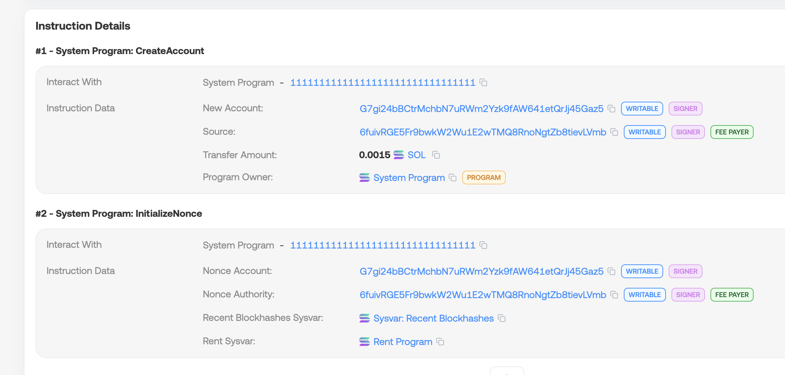
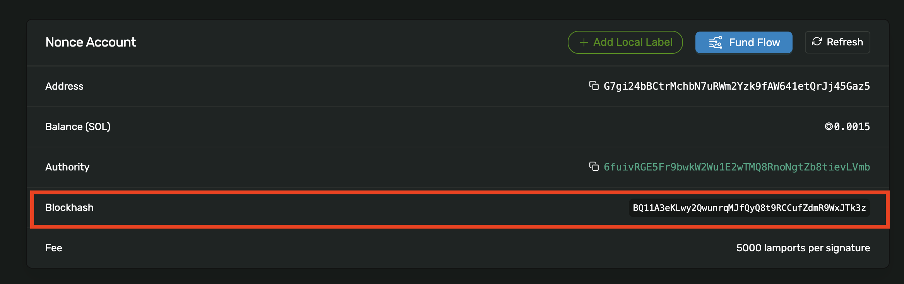
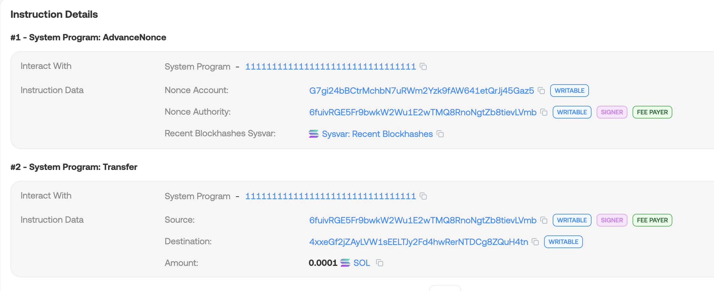
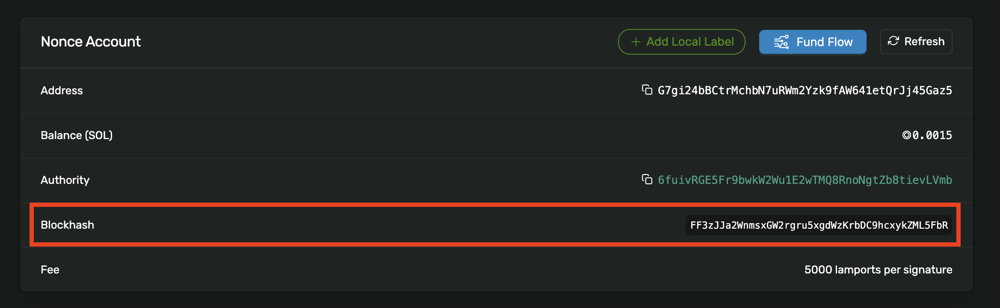

# WTF Solana Web3.js 极简教程：第 11 讲：Nonce账户

WTF Solana Web3.js 极简教程属于 WTF Solana 教程的一部分，由 WTF Academy 和 ChainBuff 共同推出。

**推特**：[@0xAA_Science](https://twitter.com/0xAA_Science) ｜ [@WTFAcademy_](https://twitter.com/WTFAcademy_) ｜ [@ChainBuff](https://twitter.com/ChainBuff)

**WTF Academy 社群：** [官网 wtf.academy](https://wtf.academy) | [微信群申请](https://docs.google.com/forms/d/e/1FAIpQLSe4KGT8Sh6sJ7hedQRuIYirOoZK_85miz3dw7vA1-YjodgJ-A/viewform?usp=sf_link) ｜ [Discord](https://discord.gg/5akcruXrsk)

所有代码和教程开源在 GitHub: [github.com/WTFAcademy/WTF-Solana](https://github.com/WTFAcademy/WTF-Solana)

---

在本讲中，我们将介绍 Durable Nonce （持久Nonce）机制，支持构造可延迟广播的交易。

## 1. 什么是 Durable Nonce

Solana默认交易使用最近 blockhash，有效期为 150 个 slot（~1分钟）。也就是说一笔交易签名到发出的保质期只有1分钟。这个机制的限制很大：多签交易时，一方签署交易，其他方稍后才能确认，但要是超过1分钟，前面交易就失效了。

为了解决这一问题，Solana 引入了 Durable Nonce 机制，允许用户构造可延迟广播的交易，类似以太坊钱包的nonce。由于账户没有内置的nonce，因此想用nonce的话就需要开个账户来存，也就有了 Nonce Account（Nonce账户）的概念了。Nonce Account 是一种特殊的账户，它存储了一个可以用于交易的”稳定blockhash“：你可以反复使用它，直到你显式的更新这个 blockhash。它常被用于交易机器人、多签钱包、预定交易。

## 2. 构造 Nonce 账户

要创建 Nonce 账户，你需要先在交易中使用 `SystemProgram.createAccount()`，它的功能是创建一个Nonce账户。


然后需要使用 `SystemProgram.nonceInitialize()` 来初始化 nonce 账户，传入参数的为nonce账户的pubkey和钱包的pubkey（作为授权公钥）。

```ts
{
  Keypair,
  SystemProgram,
  sendAndConfirmTransaction,
  Transaction,
  NONCE_ACCOUNT_LENGTH,
  clusterApiUrl,
  PublicKey,
  LAMPORTS_PER_SOL
} from "@solana/web3.js";
import bs58 from "bs58";
import fs from "fs";

const connection = new Connection(clusterApiUrl("mainnet-beta"), "confirmed");

// 导入 payer 钱包
const payer = Keypair.fromSecretKey(bs58.decode(fs.readFileSync("wallet.txt", "utf-8")));

// 创建 nonce account
const nonceAccount = Keypair.generate();
const noncePubkey = nonceAccount.publicKey;

const main = async () => {  
  // 创建交易（用 SystemProgram 初始化）
  const tx = new Transaction().add(
    SystemProgram.createAccount({
      fromPubkey: payer.publicKey,
      newAccountPubkey: noncePubkey,
      lamports: 0.0015 * LAMPORTS_PER_SOL, // connection.getMinimumBalanceForRentExemption(NONCE_ACCOUNT_LENGTH),
      space: NONCE_ACCOUNT_LENGTH,
      programId: SystemProgram.programId,
    }),
    SystemProgram.nonceInitialize(
      {
        noncePubkey: noncePubkey,
        authorizedPubkey: payer.publicKey,
      }
    )
  );

  const sig = await sendAndConfirmTransaction(connection, tx, [payer, nonceAccount]);
  console.log("交易成功！交易哈希:", sig);
  console.log(`查看交易：https://solscan.io/tx/${sig}`);
  console.log("Nonce Account:", noncePubkey.toBase58());
```

输出：

```shell
交易成功！交易哈希: 3ZfDmoRGCHB4ehUFQ97r6UBEU5NySTqt6Ha3RVhkdce4GsmCC8ZRVvDML3KLxjZ7ivhESjWndYZ5DGg6BDm217xj
查看交易：https://solscan.io/tx/3ZfDmoRGCHB4ehUFQ97r6UBEU5NySTqt6Ha3RVhkdce4GsmCC8ZRVvDML3KLxjZ7ivhESjWndYZ5DGg6BDm217xj
Nonce Account: G7gi24bBCtrMchbN7uRWm2Yzk9fAW641etQrJj45Gaz5
```

可以看到，我们在钱包账户下成功创建了一个 Nonce Account，地址为 `G7gi24bBCtrMchbN7uRWm2Yzk9fAW641etQrJj45Gaz5`。



## 3. 读取 Nonce

初始化 Nonce Account 之后，它里面会存一个特殊的 `blockhash`，计算方式为 `hash("DURABLE_NONCE" + Blockhash)`。而这里使用的 `Blockhash` 由 `SysvarRecentB1ockHashes`给出，没法提前确定，因此使用前我们要读取它：

```ts
const info = await connection.getNonce(noncePubkey);
console.log("当前 nonce (blockhash):", info?.nonce);
```

输出:

```shell
当前 nonce (blockhash): BQ11A3eKLwy2QwunrqMJfQyQ8t9RCCufZdmR9WxJTk3z
```

我们也可以在区块浏览器中确认我们读的nonce是正确的：



## 4. 使用并更新nonce

使用 durable nonce 进行交易需要两步。第一步是使用 `SystemProgram.nonceAdvance()` 构建 `Advance Nonce` 指令来更新 nonce。

```ts
// 构造交易：nonce advance + transfer
const advanceIx = SystemProgram.nonceAdvance({
  noncePubkey: noncePubkey,
  authorizedPubkey: payer.publicKey,
});

const transferIx = SystemProgram.transfer({
  fromPubkey: payer.publicKey,
  toPubkey: receiver, 
  lamports: 0.0001 * LAMPORTS_PER_SOL,
});

const tx2 = new Transaction().add(advanceIx).add(transferIx);
```

构造交易时，一定要把 `Advance Nonce` 指令放在交易的第一步，不然节点就不能识别出你是用的 `durable nonce` 交易，会报错。

第二步，你需要把交易的 `blockhash` 设定为 `Nonce Acount` 保存的 nonce，也就是上一节读取的值。

```ts
tx2.recentBlockhash = nonce;
```

使用 durable nonce 转账 0.001 SOL 的完整代码：

```ts
const info = await connection.getNonce(noncePubkey);
console.log("当前 nonce (blockhash):", info?.nonce);

// 构造交易：nonce advance + transfer
const advanceIx = SystemProgram.nonceAdvance({
  noncePubkey: noncePubkey,
  authorizedPubkey: payer.publicKey,
});

const transferIx = SystemProgram.transfer({
  fromPubkey: payer.publicKey,
  toPubkey: receiver, 
  lamports: 0.0001 * LAMPORTS_PER_SOL,
});

const tx2 = new Transaction().add(advanceIx).add(transferIx);

// 使用 durable nonce 而非最新 blockhash
tx2.recentBlockhash = info?.nonce;
//tx2.feePayer = payer.publicKey;

tx2.sign(payer); // 必须由 nonce authority 签名

const serialized = tx2.serialize();

// 可离线保存后广播
const sig2 = await connection.sendRawTransaction(serialized);
console.log("广播成功，交易哈希:", sig2);

const info2 = await connection.getNonce(noncePubkey);
console.log("更新后的 nonce (blockhash):", info2?.nonce);
```

输出：

```
当前 nonce (blockhash): BQ11A3eKLwy2QwunrqMJfQyQ8t9RCCufZdmR9WxJTk3z
广播成功，交易哈希: 5mnTiLWd7K8BZrBCCPAUs2isGg7px1xWh7p1PW2eUaWGEp1tpVNsvJ2GhjWpucvf1VEPz3YronjSwf9jCAbg89ZT
更新后的 nonce (blockhash): FF3zJJa2WnmsxGW2rgru5xgdWzKrbDC9hcxykZML5FbR
```

可以看到，使用 durable nonce 的交易成功上链，并且 Advance Nonce 指令在第一位：



此时，Nonce Acount 中保存的 blockhash 已经被消费并更新：



## 5. 总结

这一讲，我们介绍了 Solana 中 Durable Nonce 的概念，包括创建 Nonce Acount，读取 nonce，使用并更新 nonce 发送交易。Durable Nonce 机制使得交易不再受1分钟过期的限制，优化了预定交易、多签钱包、交易机器人等用例。