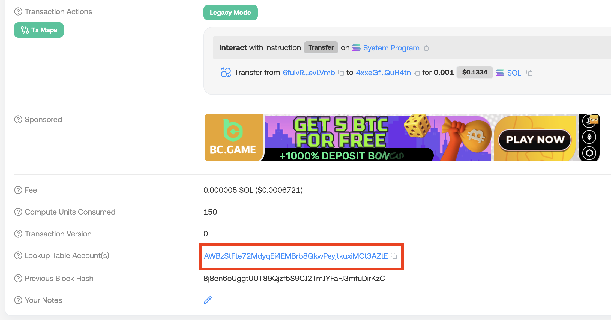
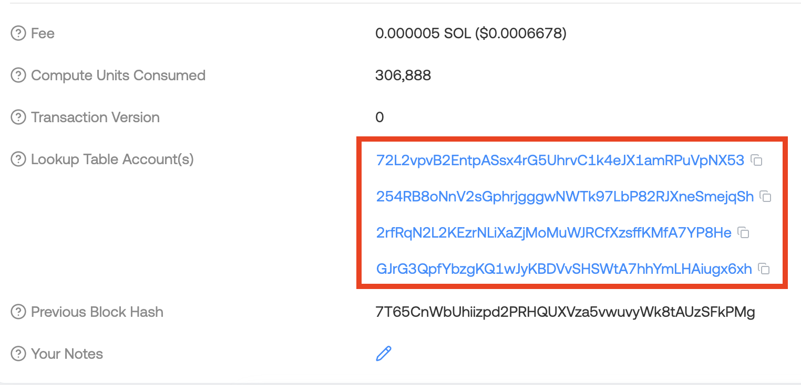

# WTF Solana Web3.js 极简教程：第 11 讲：ALT和V0交易

WTF Solana Web3.js 极简教程属于 WTF Solana 教程的一部分，由 WTF Academy 和 ChainBuff 共同推出。

**推特**：[@0xAA_Science](https://twitter.com/0xAA_Science) ｜ [@WTFAcademy_](https://twitter.com/WTFAcademy_) ｜ [@ChainBuff](https://twitter.com/ChainBuff)

**WTF Academy 社群：** [官网 wtf.academy](https://wtf.academy) | [微信群申请](https://docs.google.com/forms/d/e/1FAIpQLSe4KGT8Sh6sJ7hedQRuIYirOoZK_85miz3dw7vA1-YjodgJ-A/viewform?usp=sf_link) ｜ [Discord](https://discord.gg/5akcruXrsk)

所有代码和教程开源在 GitHub: [github.com/WTFAcademy/WTF-Solana](https://github.com/WTFAcademy/WTF-Solana)

---

这一讲，我们将介绍 Solana 的地址查找表（ALT，Address Lookup Table）机制。它是为了解决交易体积限制而引入的一项扩展功能，也是构建V0 交易格式的关键。


## 1. 为什么需要 ALT？

在Solana传统版本（Legacy）的交易格式中：

- 单笔交易体积限制为 **1232 字节**；
- 每条交易必须显式列出所有账户的地址；
- 一个交易最多支持 **32 个账户地址**；

但是在设计复杂 DeFi 操作时，很容易超出32个账户的限制。例如 jupiter 路由经的交易常会用到 30+ 账户。为了解决这一问题，Solana 在 2022 年引入了 ALT（地址查找表）。ALT 允许开发人员创建相关地址的集合，以便在单个交易中有效地加载更多地址。借助它，开发者可以将该限制提高到单笔交易 64 个地址。


## 2. ALT 原理

ALT 是一种特殊类型的账户，每个用户或程序可独立创建。每个ALT最大可以容纳256个地址，可以由创建者或授权者更新。

简单来说，ALT 允许用户预先将一组地址保存在链上，并在之后的V0交易中按“索引”引用，从而压缩地址空间、降低交易体积：原先单个地址32字节，而使用ALT后的单个索引仅占1字节。

```
┌────────┐         ┌────────────────────┐
│ V0交易  │────────▶│ ALT（地址查找表）    │
└────────┘         └────────────────────┘
    │ 引用索引             │ 地址列表（最大256个）
    ▼                     ▼
  索引 = 3     =>   第3个地址 = 3Cmv8...
   1字节                32字节
```

## 3. 创建 ALT

你可以使用 web3js 提供的 `AddressLookupTableProgram` 创建和管理 ALT 账户。首先，我们使用 `createLookupTable` 创建 ALT：

```ts
import {
  Connection,
  Keypair,
  SystemProgram,
  sendAndConfirmTransaction,
  Transaction,
  clusterApiUrl,
  PublicKey,
  AddressLookupTableProgram
} from "@solana/web3.js";
import bs58 from "bs58";
import fs from "fs";

const connection = new Connection(clusterApiUrl("mainnet-beta"), "confirmed");

// 导入 payer 钱包
const payer = Keypair.fromSecretKey(bs58.decode(fs.readFileSync("wallet.txt", "utf-8")));

// 接收者地址（可以改为你的另一个钱包）
const receiver = new PublicKey("4xxeGf2jZAyLVW1sEELTJy2Fd4hwRerNTDCg8ZQuH4tn");


const main = async () => {
  const slot = await connection.getSlot();

  // 使用 createLookupTable 创建 ALT，得到createInst指令和ALT地址
  const [createIx, lookupTableAddress] =
    AddressLookupTableProgram.createLookupTable({
      authority: payer.publicKey, // 授权地址
      payer: payer.publicKey,     // 租金支付地址
      recentSlot: slot,
    });
  
  console.log("ALT地址:", lookupTableAddress.toBase58());
```

接下来，我们使用 extendLookupTable 在ALT中添加地址，每个交易可以添加多个。每个ALT账户最多包含256个地址。

```ts
  // 使用 extendLookupTable 在ALT中添加地址，得到extendIx指令
  const extendIx = AddressLookupTableProgram.extendLookupTable({
    lookupTable: lookupTableAddress,
    authority: payer.publicKey,
    payer: payer.publicKey,
    addresses: [
      receiver,
      SystemProgram.programId
      // 可添加多个，一次最多32个，每个ALT最多包含256个地址
    ],
  });
```

创建交易：创建ALT账户并添加地址：

```ts
  const tx = new Transaction().add(createIx, extendIx);
  const sig = await sendAndConfirmTransaction(connection, tx, [payer]);
  console.log("交易成功！交易哈希:", sig);
  console.log(`查看交易：https://solscan.io/tx/${sig}`);
```

输出：

```shell
ALT地址: AWBzStFte72MdyqEi4EMBrb8QkwPsyjtkuxiMCt3AZtE
交易成功！交易哈希: 218XrwNyN9AQWGbS4PRWMebJFAHELvTzWVwov8ds6RyM8Je7Fy4vRFcvdk5JGvUztZvPpf34axMduRw5aGgdkAAX
查看交易：https://solscan.io/tx/218XrwNyN9AQWGbS4PRWMebJFAHELvTzWVwov8ds6RyM8Je7Fy4vRFcvdk5JGvUztZvPpf34axMduRw5aGgdkAAX
```

> 创建和管理ALT的时候，你可以用传统（legacy）或V0交易格式。但是只有V0交易格式能够通过索引引用这些地址。

## 4. 使用 ALT 发送 V0 交易

我们可以通过 `connection.getAddressLookupTable()` 获取 ALT 账户信息。

```ts
const lookupTableAccount = (
  await connection.getAddressLookupTable(lookupTableAddress)
).value;
console.log("ALT账户:", lookupTableAccount);
```

输出：

```shell
ALT账户: AddressLookupTableAccount {
  key: PublicKey [PublicKey(AWBzStFte72MdyqEi4EMBrb8QkwPsyjtkuxiMCt3AZtE)] {
    _bn: <BN: 8d3373e71aacce55743601eacc70244e9fe3b1284365f449a1ccb10fe4e6f243>
  },
  state: {
    deactivationSlot: 18446744073709551615n,
    lastExtendedSlot: 348699914,
    lastExtendedSlotStartIndex: 0,
    authority: PublicKey [PublicKey(6fuivRGE5Fr9bwkW2Wu1E2wTMQ8RnoNgtZb8tievLVmb)] {
      _bn: <BN: 54421e848285e7bbb1e8547340659d3cae0474188354d6a7830c5cf573765a32>
    },
    addresses: [
      [PublicKey [PublicKey(4xxeGf2jZAyLVW1sEELTJy2Fd4hwRerNTDCg8ZQuH4tn)]]
    ]
  }
}
```

然后，我们可以利用ALT构建V0交易：

```ts
  // 获取最新的 blockhash
  const { blockhash } = await connection.getLatestBlockhash();
  // 转账指令
  const TransferIx = SystemProgram.transfer({
    fromPubkey: payer.publicKey,
    toPubkey: receiver,
    lamports: 0.001 * LAMPORTS_PER_SOL,
  });

  // 创建 v0 message
  const messageV0 = new TransactionMessage({
    payerKey: payer.publicKey,
    recentBlockhash: blockhash,
    instructions: [TransferIx],
  }).compileToV0Message(lookupTableAccount ? [lookupTableAccount] : []);

  // 创建并发送交易
  const txV0 = new VersionedTransaction(messageV0);
  txV0.sign([payer]);
  const signature = await connection.sendTransaction(txV0);
  console.log("交易已发送，签名:", signature);

  // 等待交易确认
  console.log("等待交易确认...");
  const confirmation = await connection.confirmTransaction(signature, "confirmed");

  if (confirmation.value.err) {
    console.error("交易失败:", confirmation.value.err);
  } else {
    console.log("交易成功确认！");
    console.log("交易签名:", signature);
  }
```

输出：

```shell
交易已发送，签名: 4SfCBbs14ttB1KzUmb2CUH8HPqSdSCNYg27M5fRqPM9r9AMs3hC7jjgR4vrZGQvr5JYyYHaX6Vaat6jdtBd5ZfJU
等待交易确认...
交易成功确认！
交易签名: 4SfCBbs14ttB1KzUmb2CUH8HPqSdSCNYg27M5fRqPM9r9AMs3hC7jjgR4vrZGQvr5JYyYHaX6Vaat6jdtBd5ZfJU
```

可以看到，这次转账交易已经成功利用了ALT：




## 5. ALT 实用场景举例

| 场景        | 好处                       |
| --------- | ------------------------ |
| 多合约调用     | 将合约地址预存入 ALT，避免交易因超长而失败  |
| 交易路由     | 维护常用LP池子地址，用于构造复杂的交易路径 |

下图中的 jupiter [交易](https://solscan.io/tx/63ajBSS7wbspuohWx9uTaZdojh2AxqTNVZuXi1fQtVGqwLpnw7z9Y9S7ECfwggdgCsTjNo2u4Lf78i272gSvwiCj)使用了多达4个ALT账户：



## 6. 小结

这一讲，我们介绍了 ALT（地址查找表），以及如何基于 ALT 构造V0交易。Solana 上的传统交易格式单笔交易最多支持 32 个账户地址，限制了复杂的 DeFi 交易；而通过 ALT 构建的V0交易最多可以使用64个地址，支持更多账户的复杂操作。

