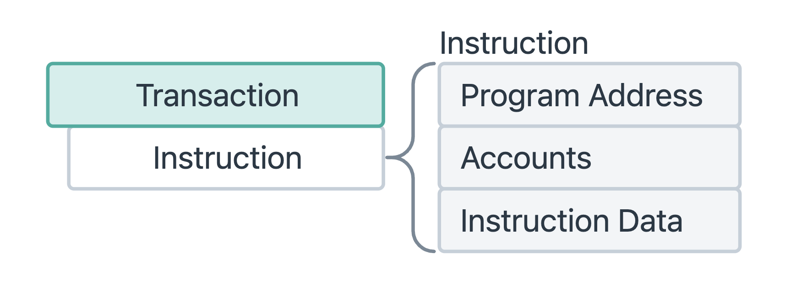
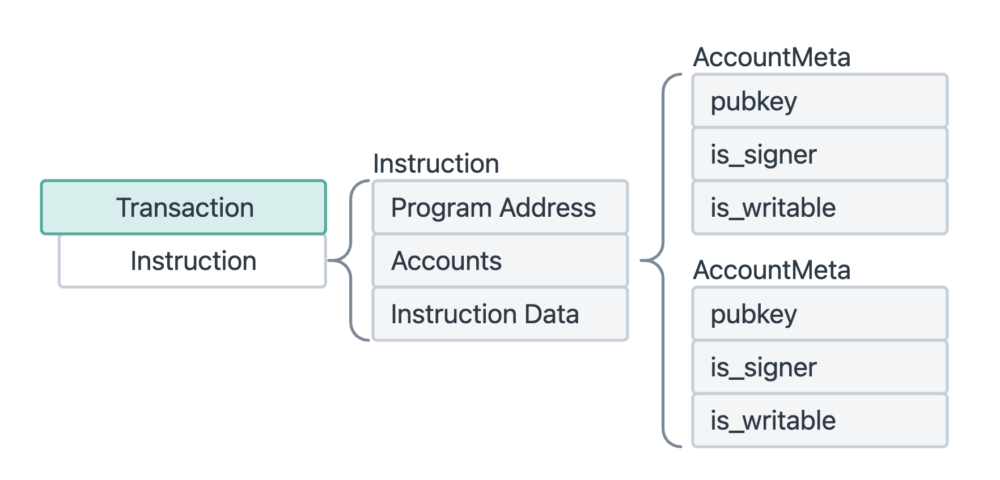
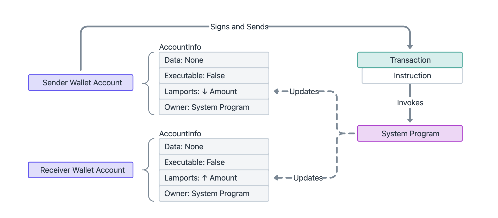

# WTF Solana Web3.js 极简教程：第 13 讲 调用合约

WTF Solana Web3.js 极简教程属于 WTF Solana 教程的一部分，由 WTF Academy 和 ChainBuff 共同推出。

**推特**：[@0xAA_Science](https://twitter.com/0xAA_Science) ｜ [@WTFAcademy_](https://twitter.com/WTFAcademy_) ｜ [@ChainBuff](https://twitter.com/ChainBuff)

**WTF Academy 社群：** [官网 wtf.academy](https://wtf.academy) | [微信群申请](https://docs.google.com/forms/d/e/1FAIpQLSe4KGT8Sh6sJ7hedQRuIYirOoZK_85miz3dw7vA1-YjodgJ-A/viewform?usp=sf_link) ｜ [Discord](https://discord.gg/5akcruXrsk)

所有代码和教程开源在 GitHub: [github.com/WTFAcademy/WTF-Solana](https://github.com/WTFAcademy/WTF-Solana)

---

这一讲，我们将详细介绍交易的构建单元：指令（Instruction），然后利用它调用系统程序，完成转账。

## 1. 指令

我们之前讲过，Solana上的所有交易都由一个或多个指令构成。而指令由以下几部分构成：

- keys: 执行指令会用到的所有账户，以 `AccountMeta` 对象数组的形式存储。
- Program ID: 程序ID，类比以太坊中的合约地址。
- Data: 数据，以 Buffer 的形式存储，类比以太坊中的calldata。

```ts
new TransactionInstruction({
  keys: AccountMeta[],      // 本次调用所涉及的账户
  programId: PublicKey,     // 要调用的程序地址
  data: Buffer              // 要传入程序的自定义数据（通常是函数编码 + 参数）
})
```



相比以太坊交易，Solana 指令中多了账户地址（account keys）。这是为了并行化服务：节点在执行指令前，需要知道所有会读写的账户，以便检查账户是否冲突。如果两个交易不冲突，就可以并行执行，极大提高 TPS。

## 2. Account Meta

指令所需的每个帐户都必须包含以下内容：

```ts
pub struct AccountMeta  {
    /// 一个账户的公钥。
    pub  pubkey ： 公钥，
    /// 如果“指令”需要与“公钥”匹配的“交易”签名，则为真。
    pub  is_signer ： bool ，
    /// 如果帐户数据或元数据在程序执行期间可能发生改变，则为 True。
    pub  is_writable :  bool ，
}
```



> 不需要修改相同账户的交易可以被节点并行执行。

举个例子，如果我们想从账户A向账户B转账，就需要在指令中声明这两个账户。账户A的 `isSigner` 和 `isWritable` 均为 `true`：因为它要签字，并且账户余额会被修改。而账户B的 `isSigner=false` `isWritable=ture`，因为它不需要进行签名，但是余额同样会被修改。

```ts
keys: [
  { pubkey: accountA, isSigner: true, isWritable: true },
  { pubkey: accountB, isSigner: false, isWritable: false }
]
```



## 3. data

指令中的 `data` 字段是向程序传递参数的唯一通道，你可以把它理解为以太坊中的 `calldata`。它的类型为 `Buffer`（二进制字节数组），用来向目标程序传递指令编号、数值参数、字符串等信息。

我们会在后面的章节详细的讲解如何构建 `data`。现在我们只看一个简单的例子：在转账指令中，我们调用的目标账户为系统账户（System Program），需要在 `data` 中明确转账功能对应的指令编号和转账的数额（lamports），分别占用 4 和 8 字节：

```ts
const data = Buffer.alloc(12); // u32 + u64 = 4 + 8 = 12 字节
data.writeUInt32LE(2, 0);      // instruction index: 2 (Transfer)
data.writeBigUInt64LE(BigInt(0.001 * LAMPORTS_PER_SOL), 4); // lamports 写入 offset=4 开始的位置
console.log("data", data);
```

## 4. 构造转账指令

下面，我们从底层构造第3讲的转账指令。转账 SOL 底层其实调用的是系统程序，它的地址为 `11111111111111111111111111111111`。我们利用 `TransactionInstruction`，把账户和组装好的`data`填入，就从底层组装好了转账指令。

```ts
const instruction = new TransactionInstruction({
  keys: [
    { pubkey: sender.publicKey, isSigner: true, isWritable: true },
    { pubkey: receiver, isSigner: false, isWritable: true },
  ],
  programId: SystemProgram.programId,
  data: data
});
```

完整代码：

```ts
import {
  Connection,
  clusterApiUrl,
  Keypair,
  PublicKey,
  LAMPORTS_PER_SOL,
  SystemProgram,
  Transaction,
  sendAndConfirmTransaction,
  TransactionInstruction
} from "@solana/web3.js";
import bs58 from "bs58";
import fs from "fs";

// 连接主网
const connection = new Connection(clusterApiUrl("mainnet-beta"), "confirmed");

// 从本地导入发送者私钥（请确保保密）
const secretKeyBase58 = fs.readFileSync("wallet.txt", "utf-8");
const sender = Keypair.fromSecretKey(bs58.decode(secretKeyBase58));

// 接收者地址（可以改为你的另一个钱包）
const receiver = new PublicKey("4xxeGf2jZAyLVW1sEELTJy2Fd4hwRerNTDCg8ZQuH4tn");

const transferIx = async () => {
  // 1. 打印当前发送者余额
  const balance = await connection.getBalance(sender.publicKey);
  console.log(`当前余额: ${balance / LAMPORTS_PER_SOL} SOL`);

  // 2. 构建转账指令的Buffer
  const data = Buffer.alloc(12); // u32 + u64 = 4 + 8 = 12 字节
  data.writeUInt32LE(2, 0);      // instruction index: 2 (Transfer)
  data.writeBigUInt64LE(BigInt(0.001 * LAMPORTS_PER_SOL), 4); // lamports 写入 offset=4 开始的位置
  console.log("data", data);

  // 3. 使用 TransactionInstruction 构建转账指令（0.001 SOL）
  const instruction = new TransactionInstruction({
    keys: [
      { pubkey: sender.publicKey, isSigner: true, isWritable: true },
      { pubkey: receiver, isSigner: false, isWritable: true },
    ],
    programId: SystemProgram.programId,
    data: data
  });
    
  // 4. 创建交易
  const transaction = new Transaction().add(instruction);

  // 5. 发送交易
  console.log("正在发送交易...");
  const signature = await sendAndConfirmTransaction(connection, transaction, [sender]);

  console.log("交易成功！交易哈希:", signature);
  console.log(`查看交易：https://solscan.io/tx/${signature}?cluster=mainnet-beta`);
};

const main = async () => {
  await transferIx();
};

main();
```

输出：

```shell
当前余额: 0.08458368 SOL
data <Buffer 02 00 00 00 40 42 0f 00 00 00 00 00>
recentBlockhash 3fJTMdbMqFaL9rKJRq81c5oZLrKQeLWQ6pWth7McJsVT
正在发送交易...
交易成功！交易哈希: 5G3nVjD1uWF2F9CMCCy2NRDSkjcYgQMsjGiAbtg5e4W1f1q6KVfXw8jdWEzHsZD4BZFNJ7ewtmXexSY4YLQfoJeH
```

## 5. 总结

这一讲，我们介绍了如何从底层构建交易的基本单元：指令。它有三要素：程序地址、账户列表、数据（keys, programId, data）。并且我们从底层构造了转账指令：它能调用系统程序以完成转账。

和以太坊不同，Solana为了并行计算，交易需要提供所有可能被读写的账户，否则运行时无法访问。在后续的课程中，我们将会深入介绍如何构建交易数据。
